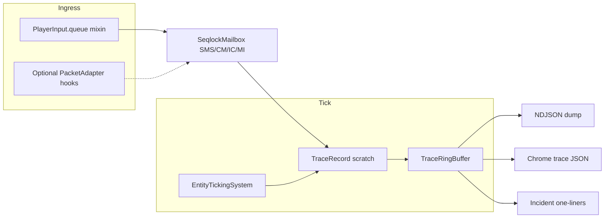

# AmoreServerCommFramework

**Primary name:** AmoreServerCommFramework  

**Also known as:** AmoreInputFlightRecorder · AmoreAbilityTraceKit · AmoreMovementTelemetry

Reusable **per-player input trace** pipeline for Hytale server mods: bounded ring buffer, mailbox summaries aligned with `PlayerInput.queue` ingress, NDJSON and Chrome/Perfetto-style JSON dumps, and rate-limited incident lines.

## Architecture



- **`amore.servercomm.capture`** — `InputQueueIngress` records `SetMovementStates` and best-effort `ClientMovement` / interaction types (reflection where needed).
- **`amore.servercomm.mailbox`** — `SeqlockMailbox` + `MailboxSnapshot` (last arrivals, seq counters, packed movement bits).
- **`amore.servercomm.ring`** — Power-of-two `TraceRingBuffer` of preallocated `TraceRecord`s.
- **`amore.servercomm.tick`** — `TraceRecord` field layout (tick id, rx times, FSM snapshot hooks, apply result, extras).
- **`amore.servercomm.dump`** — `NdjsonDumper`, `PerfettoTraceDumper` (full `args`), `CborTraceDumper` / `CborDumpHook` (RFC 8949, no extra deps), `TraceDumpService` (NDJSON / Perfetto / CBOR).
- **`amore.servercomm.dump.cbor`** — `CborWriter` (minimal encoder).
- **`amore.servercomm.capture.WirePacketIngress`** — call from **PacketAdapter** code paths; mixin still uses `InputQueueIngress`.
- **`amore.servercomm.api.PacketAdapterExtensionPoint`** — integration notes (Javadoc).
- **`amore.servercomm.incident`** — `IncidentDetector` (jump edge + reject, conflict, starvation) with optional auto NDJSON dump.
- **`amore.servercomm.api`** — `ApplyResult`, `ServerComm` facade, `TraceReason` bits.

## Build

From this repo (requires `HytaleServer.jar`, `Hyxin*.jar`, JDK 25 under `../Hytale_JossDoubleJump/tools/jdk25` or local `tools/jdk25`):

```powershell
.\scripts\build.ps1
```

Output: `dist/AmoreServerCommCore.jar`

## JossDoubleJump integration

`Hytale_JossDoubleJump` consumes the JAR on `javac` classpath and merges `amore/**` classes into `JossDoubleJump.jar` (see `scripts/build.ps1`). The adapter **`JossDoubleJumpTraceBridge`** lives in package `ca.joss.jossdoublejump` (same package as `DoubleJumpComponent` for field access).

### Enable tracing (in-game)

| Command | Action |
|---------|--------|
| `/amoretraceon` | Enable trace ring + mailbox for your username |
| `/amoretraceoff` | Disable |
| `/amoretracedumpndjson` | Write last ~30s to `mods/amore-traces/*.ndjson` |
| `/amoretracedumptrace` | Write last ~30s Chrome JSON to `mods/amore-traces/*-trace.json` |
| `/amoretracedumpcbor` | Write last ~30s as CBOR array of maps to `mods/amore-traces/*.cbor` |

**In-game feedback (JossDoubleJump):** running these commands sends **`[Amore] …`** lines to your chat (toggle on/off, dump success with filename, or a short error). That confirms the command ran even when server logs are hard to read.

Use tracing **only while diagnosing** (`/amoretraceoff` after). JossDoubleJump no longer ships a hardcoded-username text trace; Amore is the supported diagnostics path.

### Extension points

- **New ability mod:** implement the same three hook pattern (post-inference, pre-decision, post-apply) and fill `TraceRecord` + `ApplyResult`.
- **True packet adapters:** call `InputQueueIngress.record(mailbox, update)` from your `PacketAdapter` handlers when the API is available.
- **CBOR:** implemented; extend `CborTraceDumper` if you add `TraceRecord` fields.

## Repo discovery

See `docs/REPO_DISCOVERY.md` for how this maps onto `Hytale_JossDoubleJump` (PowerShell + `javac` build, `EntityTickingSystem` ordering, no PacketAdapters in-repo).

## Example output

See `example-output/` for minimal NDJSON and Chrome trace JSON samples.
